# ⚡ TranscriberPro: Enterprise Audio Intelligence Engine

[](https://expo.dev)
[](https://reactnative.dev)
[](https://www.typescriptlang.org)
[](https://supabase.com)
[](https://deno.com/deploy)
[](https://ai.google.com/gemini/pro/)
[](https://nativewind.dev)

---

## 🌐 Universal Audio Intelligence 🌐

**TranscriberPro** is an enterprise-tier universal video transcription and audio-intelligence platform engineered for the modern digital landscape.

It converts any video link (Vimeo, Patreon, social platforms, direct streams, educational portals) to searchable text in under 30 seconds using a multi-stage, cost-optimized AI pipeline. Leveraging Deepgram Nova-2 for elite speech recognition and Google Gemini 3 Flash Preview Flash for zero-touch SEO metadata, chapter generation, and key takeaway extraction. Built for content creators, researchers, and compliance teams who need instant, accurate, structured transcripts within a 120fps glassmorphism UI.

**Tech Stack:**
EXPO SDK 55 | REACT NATIVE 0.83 | TYPESCRIPT | REANIMATED V4
NATIVEWIND V4 | SUPABASE (POSTGRESQL) | DENO EDGE FUNCTIONS
DEEPGRAM NOVA-2 | GOOGLE Gemini 3 Flash Preview FLASH | TANSTACK QUERY | ZUSTAND

---

## 🛡️ The 5 Technical Moats (Enterprise Differentiators)

| Strategic Pillar                   | Technological Implementation        | Market Value Proposition                                                                                                                                |
| :--------------------------------- | :---------------------------------- | :------------------------------------------------------------------------------------------------------------------------------------------------------ |
| **1. Waterfall Cost Optimization** | Tiered Extraction (`process-video`) | **API Credit Shield:** Attempts $0 scraping via native closed captions first. Only falls back to paid APIs (Deepgram/RapidAPI) if absolutely necessary. |
| **2. Anti-Block Architecture**     | Multi-proxy Audio Routing           | **Unstoppable Reliability:** Rotates between Premium APIs and high-volume Cobalt nodes to bypass CDN/datacenter IP blocking.                            |
| **3. Lightning Transcription**     | Deepgram Nova-2 API                 | **Sub-30s Processing:** Handles massive audio streams with industry-leading speed, formatting, and diarization.                                         |
| **4. Executive AI Engine**         | Google Gemini 3 Flash Preview Flash             | **Zero-Touch SEO:** Auto-generates Markdown-rich chapters, executive summaries, and high-conversion SEO metadata.                                       |
| **5. "Liquid Neon" UX**            | React Native 0.83 + NativeWind v4   | **Elite 120fps Experience:** A premium dark-mode Bento Box UI featuring hardware-accelerated GlassCards and Reanimated transitions.                     |

---

## 🗺️ The "Ironclad" Pipeline Architecture

This diagram illustrates the genius of the **Cost-Saving Waterfall**. If Layer 1 (Scraping) is successful, it completely bypasses the expensive Audio/Deepgram extraction layers, funneling straight to the AI for insight generation.

```mermaid
sequenceDiagram
    autonumber
    participant User as Client App (Zustand)
    participant DB as Supabase (videos table)
    participant EdgeFn as process-video (Deno)
    participant Scraper as L1: Captions API<br/>(Cost: $0)
    participant Audio as L2: Audio Proxy<br/>(Premium/Cobalt)
    participant STT as L3: Deepgram<br/>Nova-2
    participant AI as L4: Gemini 3 Flash Preview Flash

    User->>DB: INSERT video (status = queued)
    DB-->>User: Return video_id
    User->>EdgeFn: invoke('process-video', { video_id, url })
    EdgeFn->>DB: UPDATE status = 'downloading'

    rect rgb(20, 40, 20)
    Note over EdgeFn, Scraper: TIER 1: Zero-Cost Native Extraction
    EdgeFn->>Scraper: Attempt Native JSON3 / Client Scrape
    Scraper-->>EdgeFn: Return Transcript (Success/Fail)
    end

    alt Captions Successfully Scraped
        Note over EdgeFn, STT: 💰 BYPASS EXPENSIVE API CALLS 💰
        EdgeFn->>DB: INSERT transcripts (method: scraper)
        EdgeFn->>DB: UPDATE status = 'ai_processing'
    else Scraping Failed / No Captions
        rect rgb(40, 20, 20)
        Note over EdgeFn, STT: TIER 2 & 3: Sovereign Audio Fallback
        EdgeFn->>DB: UPDATE status = 'transcribing'
        EdgeFn->>Audio: Resolve audio stream (API -> Nodes)
        Audio-->>EdgeFn: Return valid audio_url
        EdgeFn->>STT: Transcribe Audio Stream
        STT-->>EdgeFn: Return highly accurate transcript
        EdgeFn->>DB: INSERT transcripts (method: deepgram)
        EdgeFn->>DB: UPDATE status = 'ai_processing'
        end
    end

    rect rgb(20, 20, 40)
    Note over EdgeFn, AI: TIER 4: Executive Intelligence
    EdgeFn->>AI: generateInsights(transcript, language, difficulty)
    AI-->>EdgeFn: { summary, chapters, key_takeaways, seo }
    EdgeFn->>DB: UPSERT ai_insights
    end

    EdgeFn->>DB: UPDATE status = 'completed' (w/ duration_ms)
    EdgeFn-->>User: { success: true, metrics }
```



---

## 🗺️ FUTURE-FEATURES

```mermaid
graph TD;
    A["TranscriberPro v2.0"]
    A --> B["🌍 Multi-Language Intelligence"]
    A --> C["📱 Social Media Ready"]
    A --> D["🔗 Smart Integrations"]
    A --> E["👥 Enterprise Teams"]
    A --> F["⚡ Pipeline Upgrades"]

    B --> B1["Auto-Translate Transcripts<br/>(30+ languages + TTS)"]
    B --> B2["Dialect Detection<br/>(Regional accents)"]
    B --> B3["Technical Jargon Database<br/>(Auto-correct terminology)"]
    B --> B4["Sentiment Analysis per Chapter<br/>(Emotional tone tracking)"]

    C --> C1["1-Click TikTok/Reels Generator<br/>(Auto-cut highlights with captions)"]
    C --> C2["LinkedIn Post Generator<br/>(Summary + key insights)"]
    C --> C3["Short-form Auto-Creation<br/>(Scene detection + transitions)"]
    C --> C4["SRT/VTT Download<br/>(Burned-in or soft subtitles)"]

    D --> D1["Zapier/Make Integration<br/>(Auto-save to Notion/Airtable)"]
    D --> D2["Slack Bot<br/>(Post summaries to channels)"]
    D --> D3["Discord Webhook<br/>(Community insights sharing)"]
    D --> D4["REST API for Developers<br/>(White-label transcription)"]

    E --> E1["Collaborative Annotations<br/>(Comment + tag timestamps)"]
    E --> E2["Team Editing Mode<br/>(Multi-user transcript refinement)"]
    E --> E3["Custom Glossary Sharing<br/>(Org-wide terminology)"]
    E --> E4["Shared Libraries<br/>(Reusable transcript templates)"]

    F --> F1["Batch Processing<br/>(Upload 50+ videos at once)"]
    F --> F2["Speaker Diarization<br/>(Who said what)"]
    F --> F3["Real-time Preview<br/>(Live caption during upload)"]
    F --> F4["Caching for Podcasts<br/>(Auto-transcript RSS feeds)"]

    style A fill:#00f0ff,stroke:#333,stroke-width:3px,color:#000
    style B fill:#ff00ff,stroke:#333,stroke-width:2px
    style C fill:#00ff00,stroke:#333,stroke-width:2px
    style D fill:#ffff00,stroke:#333,stroke-width:2px,color:#000
    style E fill:#ff6600,stroke:#333,stroke-width:2px
    style F fill:#0099ff,stroke:#333,stroke-width:2px
```



---

## 2. 📋 Portfolio Bio + Tech Stack (cvitae-style)

```text
TranscriberPro

Enterprise-grade universal video transcription & audio intelligence platform.
Converts any media URL to searchable text in under 30 seconds using
a multi-stage, cost-optimized AI pipeline. Uses Deepgram Nova-2 for speech
recognition and Google Gemini 3 Flash Preview Flash for zero-touch SEO metadata, chapter
generation, and key takeaway extraction. Built for content creators, researchers,
and compliance teams who need instant, accurate, structured transcripts
with a 120fps glassmorphism UI.

Tech Stack Badges:
EXPO SDK 55 | REACT NATIVE 0.83 | TYPESCRIPT | REANIMATED V4
NATIVEWIND V4 | SUPABASE (POSTGRESQL) | DENO EDGE FUNCTIONS
DEEPGRAM NOVA-2 | GOOGLE Gemini 3 Flash Preview FLASH | TANSTACK QUERY | ZUSTAND
```

---

## 📁 Exact Project Architecture

The project strictly adheres to Domain-Driven Design (DDD) tailored for Expo Router:

```text
/TranscriberPro
├── app/                      # Expo Router App Directory
│   ├── (auth)/               # Authentication flows (sign-in, sign-up)
│   ├── (dashboard)/          # Protected Routes (history, settings, video views)
│   └── _layout.tsx           # Root layout & Provider injection
├── assets/                   # Static media (icons, splash screens)
├── components/               # Reusable UI Architecture
│   ├── animations/           # Reanimated wrappers (FadeIn.tsx)
│   ├── domain/               # Business-specific (TranscriptViewer.tsx)
│   ├── layout/               # Structural (AdaptiveLayout.tsx, PageContainer.tsx)
│   └── ui/                   # Core design system (GlassCard.tsx, Button.tsx, Input.tsx)
├── constants/                # App-wide constants (theme.ts)
├── hooks/                    # Data Flow & API Hooks
│   ├── mutations/            # Data modification (useDeleteVideo.ts)
│   └── queries/              # Data fetching (useRealtimeVideoStatus.ts, useHistoryData.ts)
├── lib/                      # Core Infrastructure Interfaces
│   ├── api/                  # Edge function callers (functions.ts, queue.ts)
│   └── supabase/             # Client configuration & Secure Storage
├── services/                 # Pure Business Logic
│   └── exportBuilder.ts      # Generates SRT, VTT, DOCX, JSON, MD w/ Executive formatting
├── store/                    # Zustand Global State Management
│   ├── useAuthStore.ts       # Client-side session state & auth boundaries
│   └── useVideoStore.ts      # Active video context & pipeline telemetry
├── supabase/                 # Infrastructure as Code
│   ├── functions/            # Deno Edge Functions
│   │   ├── _shared/          # Common utilities (auth.ts, cors.ts, supabaseAdmin.ts)
│   │   ├── process-video/    # THE MONOLITHIC PIPELINE
│   │   │   ├── audio.ts      # - Audio proxy routing
│   │   │   ├── captions.ts   # - Cost-saving metadata scraper
│   │   │   ├── deepgram.ts   # - Deepgram Nova-2 Interface
│   │   │   ├── insights.ts   # - Gemini 3 Flash Preview Flash Markdown Engine
│   │   │   ├── utils.ts      # - DB Sanitization & URL normalization
│   │   │   └── index.ts      # - Atomic Orchestrator
│   │   └── webhook-handler/  # External service webhooks
│   └── seed.sql              # Database seeding
├── types/                    # Strict TypeScript Definitions
│   ├── api/                  # Frontend/Backend shared interfaces
│   └── database/             # Generated Supabase PostgreSQL Schema
└── utils/                    # Helper Functions
    ├── formatters/           # Time and text formatting
    ├── validators/           # Zod schemas (auth.ts)
    ├── videoParser.ts        # Universal URL parsing engine
    └── clientCaptions.ts     # Client-side fast-path extraction
```

---

## ⚡ Core Features Implementation

### 1. Robust State Management & Data Fetching

The frontend utilizes a highly-optimized hybrid approach. **Zustand** (`store/useAuthStore.ts`, `store/useVideoStore.ts`) handles synchronous, global UI states. **TanStack Query** (`hooks/queries/useVideoData.ts`, `useHistoryData.ts`) manages asynchronous server state, ensuring cache invalidation and background refetching are handled automatically.

### 2. The AI Insight Pipeline (GEMINI)

Once the `process-video` Edge Function securely writes the Deepgram transcription to PostgreSQL, it passes the raw context directly to Google's Gemini 3 Flash Preview Flash. Its superior context window processes entire hour-long broadcasts in a single prompt to return perfectly structured JSON containing key takeaways, timestamps, and SEO-optimized descriptions.

### 3. Real-Time UI Synchronization

Using `hooks/queries/useRealtimeVideoStatus.ts`, the frontend subscribes to Supabase Postgres Changes via WebSockets. As the Edge Functions process the queue, the `GlassCard` UI components transition seamlessly using `components/animations/FadeIn.tsx` through exact operational states without aggressive client-side polling.

---

| FEATURES                   | DETAILS                                                                   |
| :------------------------- | :------------------------------------------------------------------------ |
| **1. Multi-Language**      | Auto-detects and transcribes 30+ languages with industry-leading accuracy |
| **2. Real-time Feedback**  | Watch pipeline metrics advance live as your media processes               |
| **3. Premium Exports**     | Export instantly to Markdown, SRT, VTT, JSON, or Plain                    |
| **4. Executive Summaries** | AI generates C-Suite level summaries formatted with rich                  |
| **5. SEO Metadata**        | Auto-extracts tags and suggested titles for content publishers            |
| **6. Granular Timestamps** | Millisecond-precise segmentation mapped to the original audio             |
| **7. Cross-Platform**      | Engineered to extract audio from 10+ video hosting providers              |

---
